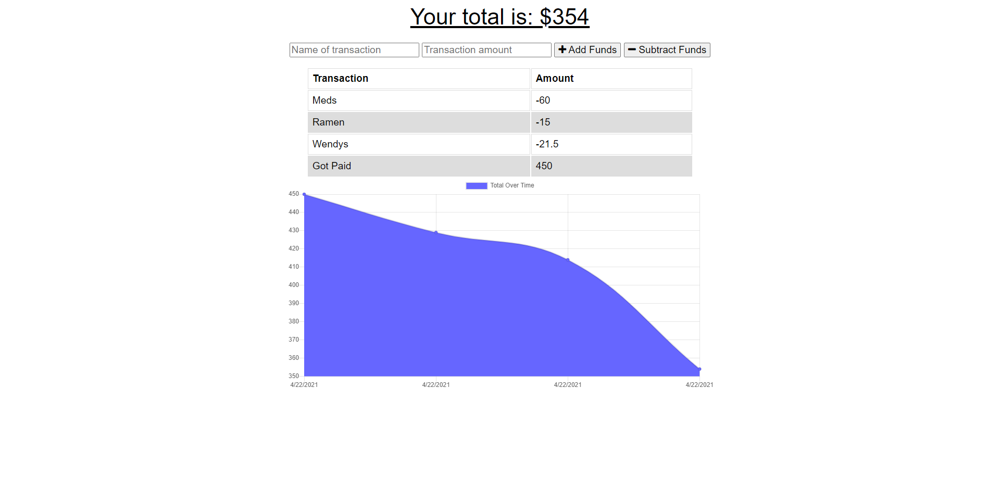

# Budget_Tracker_NP

## Description 

This app will allow the user to maintain a budget by adding and removing funds while being online or offline. Super simple add and remove funds buttons with description of what the transaction are called.

## Table of Contents

  * [Installation](#installation)
  * [Usage](#usage)
  * [Contributing](#contributing)
  * [Questions](#questions)

## Installation

  npm install

## Usage

  noder server.js
  

## Contributing

## Questions

  How to reach me?
  GitHub: https://github.com/undefined
  Email: Nickpodski@gmail.com

## Links

https://github.com/Nickpodski/Budget_Tracker_NP - Github Repo!

https://blooming-taiga-98988.herokuapp.com/ - Heroku Live Link!
  